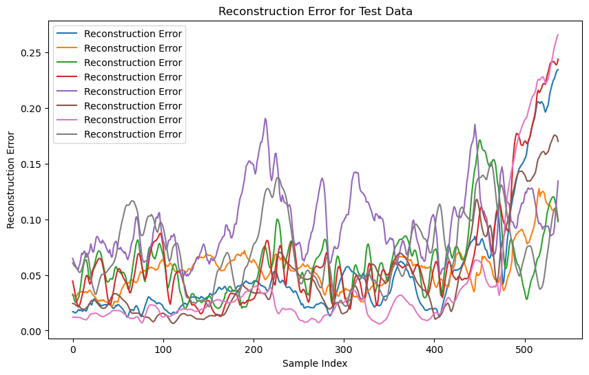

# Anomaly Detection in Stock Prices using LSTM Autoencoder

## Project Overview

This project demonstrates the use of an **LSTM Autoencoder** for anomaly detection in financial time series data, specifically Apple (AAPL) stock prices. Anomalies in stock prices can indicate significant market events, such as crashes, volatility spikes, or other abnormal behavior. The model identifies these anomalies based on reconstruction error, which highlights unusual patterns in the data that deviate from historical trends.

### Key Concepts:
- **LSTM (Long Short-Term Memory)**: A type of Recurrent Neural Network (RNN) ideal for time-series data.
- **Autoencoder**: A neural network used for unsupervised learning of data representations through compression and reconstruction.
- **Anomaly Detection**: Identifying data points that differ significantly from the expected behavior in a time-series.

## Project Structure

- `data/` : Folder containing the raw and processed data files.
- `notebooks/` : Jupyter Notebooks for data exploration and model training.
- `model/` : Saved model (`lstm_autoencoder_model.h5`) for anomaly detection.
- `src/` : Python scripts for model training, preprocessing, and anomaly detection.
- `README.md` : Project documentation.

## Requirements

- Python 3.7+
- Required libraries:
  - `numpy`
  - `pandas`
  - `tensorflow`
  - `yfinance`
  - `scikit-learn`
  - `matplotlib`
  - `talib`
  
To install the required libraries, run:

```bash
pip install -r requirements.txt
```

## Data Collection

The stock price data for **Apple (AAPL)** was collected from **Yahoo Finance** using the `yfinance` library. The dataset includes the following features:

- **Open**: The opening price of the stock.
- **High**: The highest price of the stock.
- **Low**: The lowest price of the stock.
- **Close**: The closing price of the stock.
- **Volume**: The total trading volume.

Additionally, several technical indicators were calculated using the `TA-Lib` library:

- **MACD**: Moving Average Convergence Divergence
- **RSI**: Relative Strength Index
- **SMA_20**: 20-period Simple Moving Average
- **EMA_20**: 20-period Exponential Moving Average
- **ADX**: Average Directional Index

These indicators help in capturing the underlying trends and behavior of the stock market data.

## Data Preprocessing

The following preprocessing steps were applied to the data:

1. **Scaling**: The data was scaled using **MinMaxScaler** from `sklearn` to ensure all features are in the range [0, 1].
2. **Sequence Creation**: Time series data was converted into sequences of length 30, which were then used as inputs to the LSTM Autoencoder.
3. **Train-Test Split**: The data was split into training and testing sets using `train_test_split`, while maintaining the temporal order of the data.

## Model Architecture

An **LSTM Autoencoder** architecture was used to reconstruct the input time series data and detect anomalies. The model consists of:

- **Encoder**: LSTM layers to compress the input sequences into a latent space representation.
- **Decoder**: LSTM layers to reconstruct the original sequences from the latent space.
- **Reconstruction Loss**: The reconstruction error (difference between original and reconstructed data) is used to identify anomalies.

### Model Hyperparameters:
- **LSTM units**: 50 units for both the encoder and decoder layers.
- **Batch Size**: 64
- **Epochs**: 50
- **Activation function**: ReLU for the encoder and decoder layers.

## Anomaly Detection

Anomalies are detected based on the reconstruction error. A threshold is defined to classify points with higher reconstruction errors as anomalies. The threshold was set by evaluating the reconstruction error distribution on the test set.

### Steps to Detect Anomalies:
1. **Reconstruction Error**: The model computes the reconstruction error for each data point.
2. **Anomaly Threshold**: A threshold is set based on the distribution of reconstruction errors.
3. **Flag Anomalies**: Points with reconstruction errors exceeding the threshold are flagged as anomalies.

## Results

### Visualization:
- **Reconstruction Error Plot**: Visualizes the reconstruction error for each data point in the test set.
- **Anomaly Plot**: Shows detected anomalies along with normal data points.

In the **test set**, **216 anomalies** were detected, which can represent unusual market behavior, significant price shifts, or volatility.

Example output visualizations:
- **Reconstruction Error for Test Data**:
   
- **Example Anomalies Detected**:
   

## Conclusion

This project demonstrates how an **LSTM Autoencoder** can be effectively used for anomaly detection in financial time series data. The model successfully identifies potential anomalies in Apple stock prices, which can be useful for detecting market events like crashes or abnormal price movements.

While the model’s performance could be further evaluated using ground truth labels (if available), the unsupervised nature of the approach makes it valuable for real-world financial data analysis, where labeled anomalies are often scarce.

## Future Improvements

- **Hyperparameter Tuning**: Experiment with different architectures, LSTM units, batch sizes, and epochs to optimize the model.
- **Out-of-Sample Testing**: Test the model on data from other companies or market segments to evaluate generalization.
- **Advanced Anomaly Detection**: Implement more advanced techniques like **Isolation Forests** or **Autoencoder Variants** for anomaly detection.

## How to Run the Code

1. Clone the repository:
   ```bash
   git clone https://github.com/yourusername/lstm-autoencoder-anomaly-detection.git
   cd lstm-autoencoder-anomaly-detection
   ```

2. Install dependencies:
   ```bash
   pip install -r requirements.txt
   ```

3. Run the notebook or script:
   - For Jupyter Notebook:
     ```bash
     jupyter notebook
     ```
   - Or run the Python script for model training and anomaly detection.

4. Visualize results and interpret anomalies in the output graphs.

## License

This project is licensed under the MIT License - see the [LICENSE](LICENSE) file for details.
